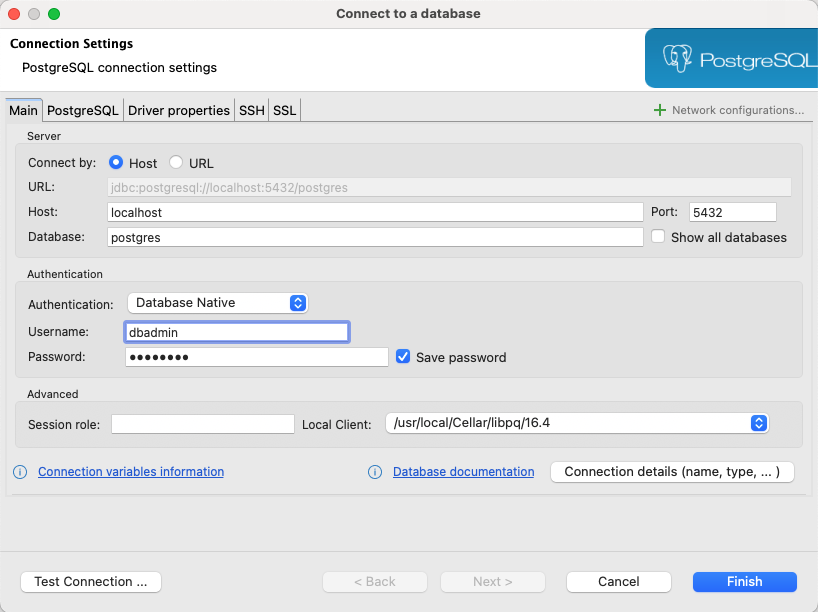
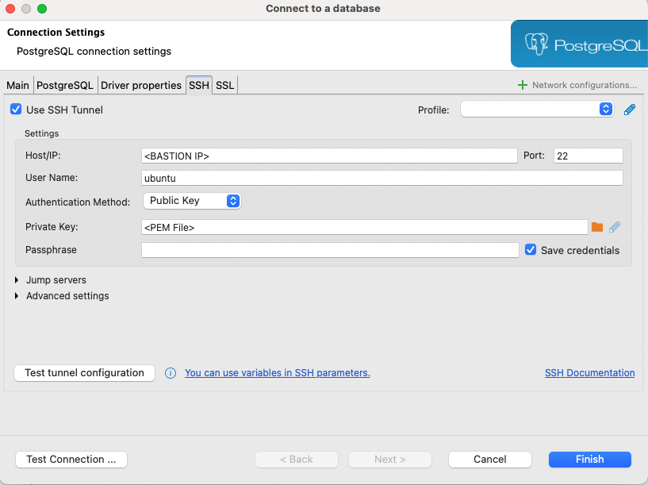

# pgnc-sql (AWS)
## Table of contents
  * [Building the AWS database infrastructure](#building-the-aws-database-infrastructure)
    * [Dependencies](#dependencies)
  * [Connecting to the DB](#connecting-to-the-db)
  * [Schema and Data dictionary](#schema-and-data-dictionary)

## Building the AWS database infrastructure

### Dependencies

The following need to be installed before you use the terraform scripts.
  * [AWS account][1]
  * [AWS CLI][3]
  * [Terraform v1.5.7][4] ([v1.5.7 binaries download][5])

### Configure the AWS CLI

First you need to log into your AWS account as the root user and then create a IAM user called "terraform-user". You will need to save the "Access key" and the "Secret access key" to be used later. Follow these [instructions][2] or view the video below for help.

[](http://www.youtube.com/shorts/cf9mI3eVf2U)

Run `aws configure` and paste in the "Access Key" and the "Secret access key" when prompt as described in the above video.

### Create a PGNC database in your AWS account

This repository will create a PostgreSQL database in your AWS account. The database will be created in a private subnet within a virtual private network. The database will be accessible through an EC2 bastion instance. The EC2 instance will be created in a public subnet within the same virtual private network. The database will be created in a private subnet within a virtual private network. The database will be accessible through an EC2 bastion instance. The EC2 instance will be created in a public subnet within the same virtual private network.


#### Create an SSH key pair

As you can see from the diagram, a user will need to communicate with the DB through the EC2 bastion instance as the DB is protected in a private subnet within a virtual private network. To do this you create a SSH tunnel. You will need an SSH key pair which you can create using the following command:

```shell
aws ec2 create-key-pair \
    --key-name pgnc \
    --key-type rsa \
    --key-format pem \
    --query "KeyMaterial" \
    --output text > pgnc.pem
```

Do not change the key name as it is used in the terraform scripts.

The above command will create a file called `pgnc.pem` in the current directory. This is your private ssh key to connect to the EC2 bastion once the aws resources have been created. Move the file to a secure location and make sure it is not publicly accessible. The command also stores the public key in the AWS account under the name `pgnc` and can be found in the AWS console under EC2 -> Network & Security -> Key Pairs.

#### Create a database admin user

The database that we will create will have an admin username and password. These credentials will be managed by the AWS Secrets Manager. The password must be at least 8 characters long and contain at least one uppercase letter, one lowercase letter, one number, and one special character. Remember that this will be your master/root username and password for the database. Yous should store this information in a secure location and create roles within the PostgreSQL database for other users.

To create DB credentials in the AWS Secrets Manager, run the following command:

```shell
aws secretsmanager create-secret \
    --name rds_admin_creds \
    --secret-string '{"username":"dbadmin","password":"<your_password>"}';
```

Please replace `<your_password>` with your desired password but leave the secrets name as `rds_admin_creds` as this is used in the terraform scripts. The password must be at least 8 characters long and contain at least one uppercase letter, one lowercase letter, one number, and one special character.

#### Create the AWS resources

After setting up the AWS CLI and completing all the dependencies, you can now create the PGNC database and associated resources. Simply run the following in the terraform directory of this repo:
```shell
terraform init;
```
```shell
terraform validate;
```
```shell
terraform plan -var-file="terraform.tfvars.json";
```
```shell
terraform apply -var-file="terraform.tfvars.json";
```

The terraform script will ask you for the your pem file path. You will need to provide the path with the file name of the `pgnc.pem` file you created earlier.

After the terraform script has completed, you will see the output of the EC2 bastion instance's public IP address.

## Connecting to the DB

To connect to the database, you will need to SSH tunnel through the EC2 bastion instance. You can create a tunnel using the following command:
```shell
ssh -i <path_to_your_pem_file> -L 5432:<db_instance_endpoint>:5432 ubuntu@<ec2_bastion_public_ip> -N
```
Once the tunnel is running, you can connect to the database using the following information:

|    HOST   | PORT | DATABASE |  USER   |     PASSWORD    |
|----------:|-----:|---------:|--------:|----------------:|
| localhost | 5432 | postgres | dbadmin | <your_password> |

You can use any PostgreSQL client to connect to the database. You can also use the `psql` command line tool to connect to the database. I would use a tool like [DBeaver][7] to connect to the database as it can handle the ssh tunnel and the DB connection.

### Connecting to the DB using `DBeaver`

1. Open DBeaver and click on the `Database` menu and select `New Database Connection`.
2. Select `PostgreSQL` from the list of databases.
3. Fill in the following information:
   * Host: `localhost`
   * Port: `5432`
   * Database: `postgres`
   * User: `dbadmin`
   * Password: `<your_password>`
     
4. Click on the SSH tab and select the `Use SSH Tunnel` checkbox.
5. Fill in the following information:
   * Host/IP: `<ec2_bastion_public_ip>`
   * Port: `22`
   * Username: `ubuntu`
   * Authentication: `Public Key`
   * Private Key: `<path_to_your_pem_file>`
     
6. Click on the `Test Connection` button to test the tunnel.
7. Click back on to the `Main` tab and click on `Test Connection` to test the database connection.
8. Click on `Finish` to save the connection if all is well.


## Schema and Data dictionary

See the [Data Dictionary](pgnc_20240624172110.pdf) for information about the schema.


[1]: https://aws.amazon.com
[2]: https://kloudle.com/academy/how-to-create-an-iam-admin-user-in-aws/
[3]: https://docs.aws.amazon.com/cli/latest/userguide/getting-started-install.html
[4]: https://developer.hashicorp.com/terraform/tutorials/aws-get-started/install-cli
[5]: https://releases.hashicorp.com/terraform/1.5.7
[6]: https://www.ssh.com/academy/ssh
[7]: https://dbeaver.io/
