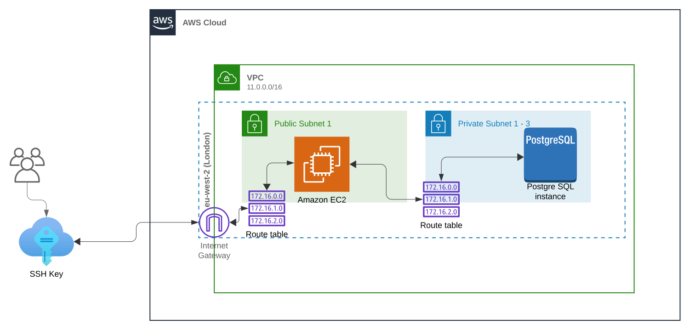

# pgnc-sql (AWS)
## Table of contents
  * [Building the AWS database infrastructure](#building-the-aws-database-infrastructure)
    * [Dependencies](#dependencies)
  * [Connecting to the DB](#connecting-to-the-db)
  * [Schema and Data dictionary](#schema-and-data-dictionary)

## Building the AWS database infrastructure

### Dependencies

The following need to be installed before you use the terraform scripts.
  * [AWS account][1]
  * [AWS CLI][3]
  * [Terraform v1.5.7][4] ([v1.5.7 binaries download][5])

### Configure the AWS CLI

First you need to log into your AWS account as the root user and then create a IAM user called "terraform-user". You will need to save the "Access key" and the "Secret access key" to be used later. Follow these [instructions][2] or view the video below for help.

[](http://www.youtube.com/shorts/cf9mI3eVf2U)

Run `aws configure` and paste in the "Access Key" and the "Secret access key" when prompt as described in the above video.

### Create a PGNC database in your AWS account

After setting up the AWS CLI and completing all the dependencies, you can now create the PGNC database and associated resources. Simply run the following in the terraform directory of this repo:
```shell
terraform init;
```
```shell
terraform validate;
```
```shell
terraform apply -var-file="terraform.tfvars.json";
```
The terraform script will produce an infrastructure architecture similar to below.


## Connecting to the DB
To Do

## Schema and Data dictionary

See the [Data Dictionary](pgnc_20240624172110.pdf) for information about the schema.


[1]: https://aws.amazon.com
[2]: https://kloudle.com/academy/how-to-create-an-iam-admin-user-in-aws/
[3]: https://docs.aws.amazon.com/cli/latest/userguide/getting-started-install.html
[4]: https://developer.hashicorp.com/terraform/tutorials/aws-get-started/install-cli
[5]: https://releases.hashicorp.com/terraform/1.5.7
